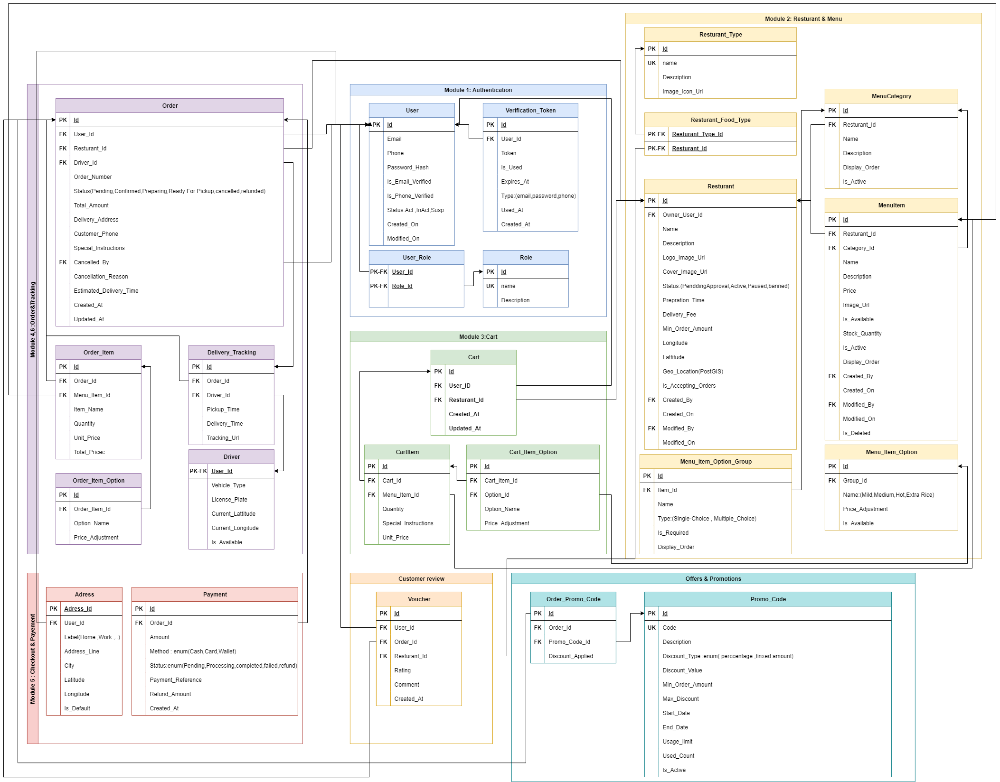

# 🍴 Food Delivery System

## 📌 Overview
This repository documents and develops a **Restaurant Browsing and Food Delivery System**.  
The project simulates how modern food delivery applications (like Talabat, Uber Eats, or Deliveroo) work — from **browsing restaurants** to **adding items to cart**, **checkout**, **payment**, and **delivery tracking**.  

The goal is to extract **requirements, features, and functionalities** for each module, then gradually build **use case diagrams, sequence diagrams, and system design**, and finally move toward implementation.

---

## 📑 Table of Contents

- **README.md** – Project overview & main documentation  

- **docs/** – Project documentation  
  - **requirements/** – Features & functionalities of each module  
  - **diagrams/** – Use case, sequence, and class diagrams  
  - **srs/** – System Requirement Specification (optional)  

- **src/** – Source code (future implementation)  
  - **backend/** – Server-side logic & APIs    

---

## 📦 Modules & Features Overview

### 1. 🔐 [User Registration & Authentication](/docs/requirements/01-registration-authentication.md)

   - Handles secure onboarding and account access.
   - User registration with email/phone verification.
   - Secure login with password hashing.
   - Password reset and account recovery.
   - Role-based access (customer, restaurant, admin).
   - Token/session-based authentication.
### 2. 🍴 [Restaurant & Menu Management](/docs/requirements/02-menu-management.md)

   - Enables customers to explore restaurants and their offerings.
   - Search restaurants, items, and categories.
   - Location-based recommendations (best sellers nearby).
   - Restaurant details (menu, reviews, delivery time, fees).
   - Special offers, flash sales, and rewards.
### 3. 🛒 [Cart Management](/docs/requirements/03-cart-management.md)

   - Customer shopping cart functionality.
   - Add/remove/edit items with special notes.
   - Apply discounts, vouchers, or coupons.
   - Persistent cart (saved even after logout/app close).
   - Payment summary (subtotal, delivery, service fee, total).

### 4. 📦 [Order Management](/docs/requirements/04-order-management.md)

   - Core system for handling orders.
   - Place new orders.
   - Cancel orders (by customer or restaurant).
   - Order status updates (tracking lifecycle).
   - Order summary & details.
   - Order history (for customers & restaurants).

### 5. 💳 [Checkout & Payment](/docs/requirements/05-checkout-payment.md)

   - Processes order confirmation and payment.
   - Select/change delivery address.
   - Choose delivery type (standard, express).
   - Multiple payment methods (cash, card, wallet).
   - Integration with payment gateways.
   - Refunds & cancellations handling.

### 6. 🛵 [Order & Delivery Tracking](/docs/requirements/06-delivery-tracking.md)

   - Real-time order tracking for customers and restaurants.
   - Track order status (accepted, preparing, out for delivery).
   - Estimated delivery time updates.
   - Live driver location.
   - Delivery system integration.

### 7. 🧑 [Customer Management](/docs/requirements/07-customer-management.md)
   - Manages customer accounts and preferences.
   - Order history & tracking.
   - Preferred payment settings (cash, card).
   - Address management (multiple delivery addresses).
   - Ratings & comments for restaurants/items.
   - Account deactivate/reactivation.

### 8. 🛠️  [Admin Management](/docs/requirements/08-admin.md)

   - System-level control for admins.
   - Manage restaurants & customers.
   - Monitor platform health.
   - Revenue/commission tracking.
   - Handle disputes, refunds, fraud detection.
   - User role/permissions management.

### 9. 🎁 [Offers & Promotions](/docs/requirements/09-offers.md)
   - Marketing features to improve engagement.
   - Discount coupons & promo codes.
   - Flash sales.
   - Restaurant-specific deals.
   - Loyalty & reward programs.

### 10. 📊 [Dashboards](/docs/requirements/10-dashboard.md)

   - Analytics & insights for decision-making.

   - **Restaurant Dashboard**
      - Sales & revenue summary.
      - Best/low-performing items.
      - Customer feedback overview.
   
   - **Admin Dashboard**
      - Platform performance (orders, users, revenue).
      - Restaurant performance monitoring.
  

---
# Database Schema Overview

This document outlines the core Entity-Relationship Diagram (ERD) for the Food Delivery System, detailing the main entities and their purposes.

 

## Entity Definitions

| Entity | Description | Module |
| :--- | :--- | :--- |
| `User` | Central account table for all platform users. Stores login credentials and core profile. | Authentication |
| `Role` | Lookup table for system roles (e.g., `customer`, `restaurant_owner`, `admin`, `driver`). | Authentication |
| `UserRole` | Junction table that manages the many-to-many relationship between Users and Roles. | Authentication |
| `VerificationToken` | Stores secure tokens for account verification emails and password reset requests. | Authentication |
| `Restaurant` | Contains all information about a restaurant, including status, location, and operational details. | Restaurant & Menu |
| `CuisineType` | Defines types of food a restaurant can serve (e.g., "Pizza", "Sushi", "Burger"). | Restaurant & Menu |
| `RestaurantCuisine` | Junction table linking Restaurants to the CuisineTypes they serve. | Restaurant & Menu |
| `MenuCategory` | A section within a restaurant's menu (e.g., "Appetizers", "Main Courses"). | Restaurant & Menu |
| `MenuItem` | The core sellable product offered by a restaurant. | Restaurant & Menu |
| `MenuItemOptionGroup` | Defines a set of choices for a menu item (e.g., "Choose Size"). | Restaurant & Menu |
| `MenuItemOption` | An individual choice within an option group (e.g., "Large"). | Restaurant & Menu |
| `Cart` | A user's temporary workspace for items before checkout. Locked to a single restaurant. | Cart Management |
| `CartItem` | An item from the menu added to the cart. Stores a snapshot of the price. | Cart Management |
| `CartItemOption` | Records the customizations chosen for a cart item. Stores a snapshot of the option details. | Cart Management |
| `Order` | The master record of a transaction. Tracks status, amount, and links to involved parties. | Order Management |
| `OrderItem` | A permanent, immutable snapshot of a purchased menu item at the time of order. | Order Management |
| `OrderItemOption` | A permanent snapshot of the customizations chosen for an order item. | Order Management |
| `Driver` | Profile information for a user with the `driver` role (vehicle, availability). | Delivery Tracking |
| `DeliveryTracking` | Tracks key timestamps and details for the delivery process. | Delivery Tracking |
| `Payment` | Records the attempt to collect payment for an order, including method and status. | Checkout & Payment |
| `Address` | Stores delivery addresses associated with a user's account. | Checkout & Payment |
| `Review` | Allows users to leave ratings and comments for a restaurant based on an order. | Customer Management |
| `PromoCode` | Defines a discount code or promotion with its rules and validity. | Offers & Promotions |
| `OrderPromoCode` | Links an applied promo code to a specific order and records the discount given. | Offers & Promotions |
---
## 📌 Use Cases

This section documents the system’s main use cases.  
Each use case includes:
- **Sequence Diagram**
- **Flowchart**
- **Pseudo Code**
- **Entity Relationship Diagram (ERD)**

### 1. Place Order
**Description:**  
A customer confirms their cart and places an order.  
The system validates item availability, delivery address, payment details, and applied vouchers.  
On success, an order is created, stored, and both customer and restaurant receive confirmation.  

**Artifacts:**  
- 💻 [Pseudo Code](docs/diagrams/use-cases/place-order/pseudo-code.md)  
- 📐 Sequence Diagram  
    

- 🗂️ Flowchart  
    

- 🗄️ ERD  
    

---

## 🎯 Project Goals
- Document system features in a structured way.  
- Model the system using UML diagrams.  
- Define functional and non-functional requirements.  
- Build a prototype implementation.  

